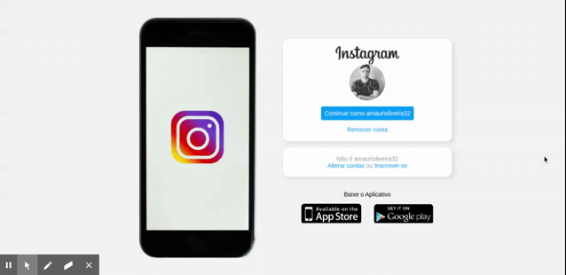

# Instagram Clone

  

## :telescope: Overview

  [🏠 Homepage](https://github.com/AmauriOliveira)
Um simples clone do Instagram feito com CSS3 e HTML5 durante uma aula da https://web.digitalinnovation.one/

## :computer: Techs

## :star2: Contributing

Contributions, issues and feature requests are welcome!

- ⭐️ Star the project
- 🐛 Find and report issues
- 📥 Submit PRs to help solve issues or add features

Feel free to check [issues page](https://github.com/AmauriOliveira/clone-instagram-DIO/issues). You can also take a look at the contributing guide.

## :bow: Author

**Amauri Oliveira** 
* Email: amauriibate32@hotmail.com
* GitHub: [@AmauriOliveira](https://github.com/AmauriOliveira)
* LinkedIn: [@amauri-oliveira-058066192](https://linkedin.com/in/amauri-oliveira-058066192)

## :books: License

Copyright © 2020 Amauri Oliveira
This project is [MIT](license) licensed.